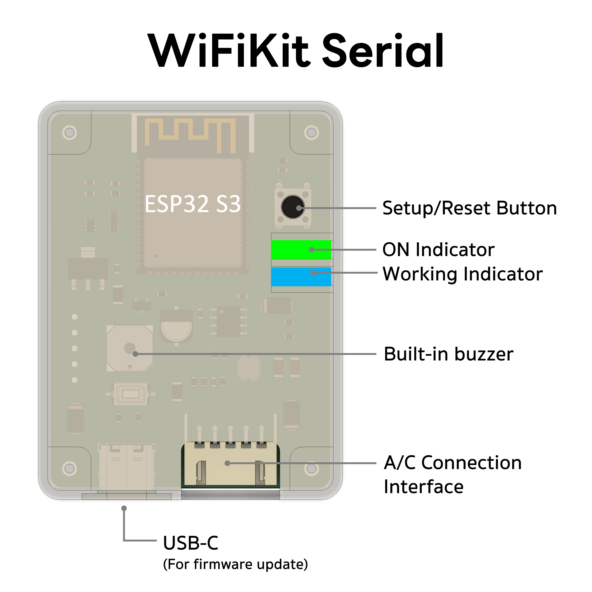
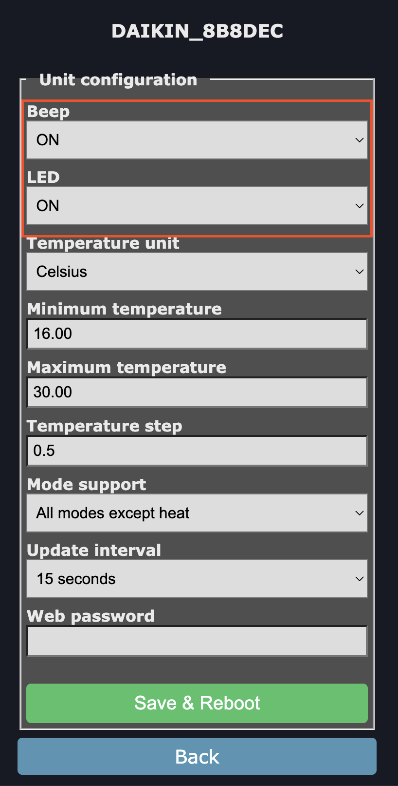

# LED Status and Module Settings

## LED Status

<table class="tg">
<thead>
  <tr>
    <th class="tg-fymr">LED</th>
    <th class="tg-fymr">Solid</th>
    <th class="tg-fymr">Blinking</th>
    <th class="tg-1wig">Off</th>
  </tr>
</thead>
<tbody>
  <tr>
    <td class="tg-ncd7">PWR (Yellow/Green)</td>
    <td class="tg-0pky">Power on, module working normally</td>
    <td class="tg-0pky">Safe Mode</td>
    <td class="tg-0lax">No power or module issue</td>
  </tr>
  <tr>
    <td class="tg-hyan">ACT (Blue)</td>
    <td class="tg-0pky">Cannot connect / AP Mode</td>
    <td class="tg-0pky">-</td>
    <td class="tg-0lax">Normal connection</td>
  </tr>
</tbody>
</table>

## Control Button

<table class="tg">
<thead>
  <tr>
    <th class="tg-1wig">Button Press Duration (seconds)</th>
    <th class="tg-1wig">Action</th>
  </tr>
</thead>
<tbody>
  <tr>
    <td class="tg-0lax">&lt; 0.5</td>
    <td class="tg-0lax">Turn air conditioner ON/OFF</td>
  </tr>
  <tr>
    <td class="tg-0lax">5 - 15</td>
    <td class="tg-0lax">Reboot module</td>
  </tr>
  <tr>
    <td class="tg-0lax">&gt; 15</td>
    <td class="tg-0lax">Factory reset</td>
  </tr>
</tbody>
</table>

## Enabling/Disabling Buzzer and LED

1. Go to the module's IP Address (you can click the VISIT button on the integration page)

2. Go to Setup -> Unit  
3. Set Beep or LED to ON or OFF  
4. Click Save & Reboot

