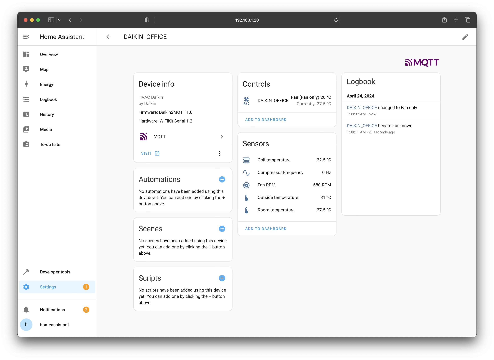

# เกี่ยวกับ WiFiKit Serial

> WiFiKit Serial คือโมดูล Wi-Fi สำหรับเชื่อมต่อเครื่องปรับอากาศเข้ากับระบบ [Home Assistant](https://www.home-assistant.io/) และ [Homebridge](https://homebridge.io/) รองรับเครื่องปรับอากาศที่มีช่อง Serial Interface บนบอร์ดสำหรับสั่งงานจากโมดูลภายนอก เช่น Mitsubishi Mr.Slim และ Daikin

## ฟีเจอร์
- ชิพประมวลผล ESP32 S3 8MB รองรับ Wi-Fi/BLE
- มี Logic Level Converter เป็น Serial TTL 5V
- รองรับไฟ DC 5V หรือ 7 - 28V
- พอร์ท USB-C สำหรับ Debug และ Upload
- มี Buzzer แจ้งการทำงาน (ปิดได้)
- ไฟ LED แสดงสถานะการทำงาน
- ปุ่มสั่งงาน / ปุ่ม Reset

## Firmware
ตัว Firmware ทำหน้าที่เชื่อมต่อตัวเครื่องปรับอากาศเข้าระบบ Home Assistant ผ่าน MQTT Protocol
ถึงแม้ว่าแอร์ทั้งสองรุ่นจะใช้ Hardware เดียวกัน แต่ว่าตัว Firmware บนบอร์ดนั้นต่างกัน โดยแอร์แต่ละยี่ห้อใช้ Firmware ดังนี้
- Mitsubishi MR.Slim: [mitsubishi2MQTT](https://github.com/maxmacstn/mitsubishi2MQTT)
- Daikin: [daikin2MQTT](https://github.com/maxmacstn/daikin2MQTT)

## ฟังก์ชั่นการทำงานที่รองรับ
ฟังก์ชั่นการทำงานในแต่ละรุ่นอาจจะแตกต่างกัน ขึ้นอยู่กับการรองรับของแอร์รุ่นนั้น ๆ 

### Mitsubishi Mr. Slim

<table class="tg">
<thead>
  <tr>
    <th class="tg"><b>คำสั่ง<b></th>
    <th class="tg" colspan="2"><b>การทำงาน<b></th>
  </tr>
</thead>
<tbody>
  <tr>
    <td class="tg-0pky" rowspan="10">คำสั่งพื้นฐาน</td>
    <td class="tg-0pky">สถานะการทำงาน</td>
    <td class="tg-0pky">เปิด/ปิด</td>
  </tr>
  <tr>
    <td class="tg-0pky" rowspan="5">โหมดการทำงาน</td>
    <td class="tg-0pky">Auto</td>
  </tr>
  <tr>
    <td class="tg-0pky">Cool</td>
  </tr>
  <tr>
    <td class="tg-0pky">Heat*</td>
  </tr>
  <tr>
    <td class="tg-0pky">Dry</td>
  </tr>
    <tr>
    <td class="tg-0pky">Fan Only</td>
  </tr>
  <tr>
    <td class="tg-0pky">การตั้งอุณภภูมิเป้าหมาย</td>
    <td class="tg-0pky">ปรับได้ความละเอียด 1°C Step</td>
  </tr>
  <tr>
    <td class="tg-0pky">ความแรงลม</td>
    <td class="tg-0pky">Auto, Quiet, 1, 2, 3, 4</td>
  </tr>
  <tr>
    <td class="tg-0pky">การส่ายแนวตั้ง</td>
    <td class="tg-0pky">Auto, Swing, 1, 2, 3, 4, 5</td>
  </tr>
  <tr>
    <td class="tg-0pky">การส่ายแนวนอน*</td>
    <td class="tg-0pky">Swing, &lt;&lt;, &lt;, |, &gt;, &gt;&gt;</td>
  </tr>
  <tr>
    <td class="tg-0pky" rowspan="2">การดูข้อมูล</td>
    <td class="tg-0pky">อุณหภูมิห้อง</td>
    <td class="tg-0pky">ความละเอียด 0.5°C </td>
  </tr>
  <tr>
    <td class="tg-0pky">การใช้พลังงาน*</td>
    <td class="tg-0pky">วัตต์</td>
  </tr>
</tbody>
</table>

\**รองรับกับเครื่องปรับอากาศบางรุ่น*

### Daikin
RA = Room Air, SkyAir = Cassette Type

<table class="tg">
<thead>
  <tr>
    <th class="tg"><b>คำสั่ง<b></th>
    <th class="tg" colspan="2"><b>การทำงาน<b></th>
  </tr>
</thead>
<tbody>
  <tr>
    <td class="tg-0pky" rowspan="9">คำสั่งพื้นฐาน</td>
    <td class="tg-0pky">สถานะการทำงาน</td>
    <td class="tg-0pky">เปิด/ปิด</td>
  </tr>
  <tr>
    <td class="tg-0pky" rowspan="4">โหมดการทำงาน</td>
    <td class="tg-0pky">Cool</td>
  </tr>
  <tr>
    <td class="tg-0pky">Dry</td>
  </tr>
  <tr>
    <td class="tg-0pky">Heat*</td>
  </tr>
  <tr>
    <td class="tg-0pky">Fan Only</td>
  </tr>
  <tr>
    <td class="tg-0pky">การตั้งอุณภภูมิเป้าหมาย</td>
    <td class="tg-0pky">RA: ปรับได้ความละเอียด 0.5°C   SkyAir: ปรับได้ความละเอียด 1°C </td>
  </tr>
  <tr>
    <td class="tg-0pky">ความแรงพัดลม</td>
    <td class="tg-0pky">Auto, 1, 2, 3, 4, 5</td>
  </tr>
  <tr>
    <td class="tg-0pky">การส่ายแนวนอน*</td>
    <td class="tg-0pky">RA: Hold, Swing  SkyAir: Swing,1,2,3,4,5</td>
  </tr>
    <tr>
    <td class="tg-0pky">การส่ายแนวตั้ง*</td>
    <td class="tg-0pky">RA: Hold, Swing  SkyAir: ไม่รองรับ</td>
  </tr>
  <tr>
    <td class="tg-0pky" rowspan="7">การดูข้อมูล</td>
    <td class="tg-0pky">อุณหภูมิห้อง</td>
    <td class="tg-0pky">ความละเอียด 0.5°C</td>
  </tr>
  <tr>
    <td class="tg-0pky">อุณหภูมิภายนอก*</td>
    <td class="tg-0pky">ความละเอียด 0.5°C</td>
  </tr>
  <tr>
    <td class="tg-0pky">อุณหภูมิคอยล์เย็น</td>
    <td class="tg-0pky">ความละเอียด 0.5°C</td>
  </tr>
  <tr>
    <td class="tg-0pky">ความเร็วพัดลมคอยล์เย็น</td>
    <td class="tg-0pky">รอบ/นาที</td>
  </tr>
  <tr>
    <td class="tg-0pky">ความถี่คอมเพรซเซอร์*</td>
    <td class="tg-0pky">Hz</td>
  </tr>
    <tr>
    <td class="tg-0pky">การใช้พลังงาน*</td>
    <td class="tg-0pky">หน่วย</td>
  </tr>
  </tr>
    <tr>
    <td class="tg-0pky">Error Code</td>
    <td class="tg-0pky">สองหลัก/สี่หลัก</td>
  </tr>
</tbody>
</table>

\**รองรับกับเครื่องปรับอากาศบางรุ่น*

### ตัวอย่างหน้า MQTT Integration

